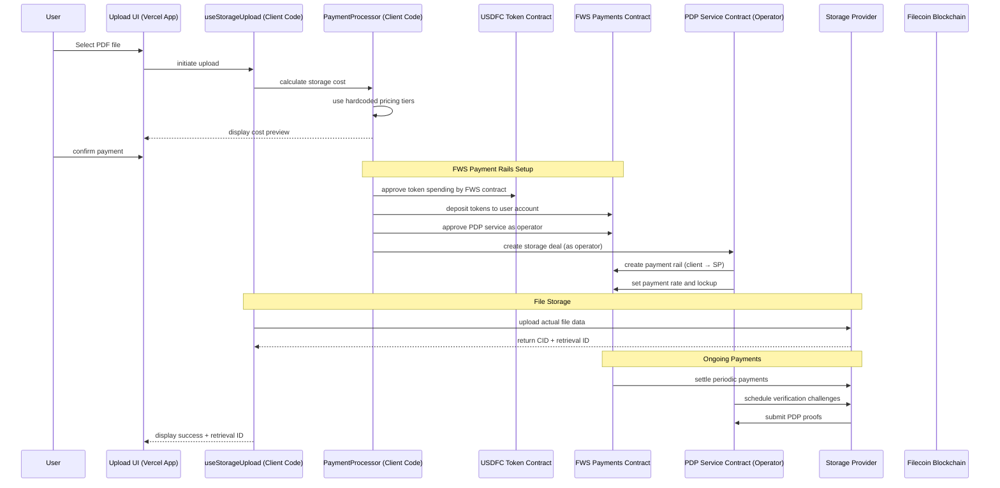

# Engineering Design: Storage Upload Flow

## 1. Current File Structure

```
filosign/
├── src/
│   ├── app/
│   │   ├── send/page.tsx                    # Document upload UI
│   │   ├── receive/page.tsx                 # Document retrieval UI
│   │   └── layout.tsx                       # Root layout with wallet provider
│   ├── components/
│   │   ├── providers/
│   │   │   └── wagmi-provider.tsx           # Wallet connection provider
│   │   ├── ui/                              # Shadcn/ui components
│   │   └── wallet-connection.tsx            # Wallet connection component
│   └── lib/
│       ├── services/
│       │   ├── pdp-contract-service.ts      # PDP smart contract interactions
│       │   ├── filecoin-storage-service.ts  # Filecoin storage operations
│       │   └── local-storage-interface.ts   # Storage abstraction layer
│       ├── hooks/
│       │   ├── use-upload-local.ts          # Local storage upload hook
│       │   └── use-upload-pdp.ts            # PDP storage upload hook
│       ├── types/pdp.ts                     # PDP-related type definitions
│       └── wagmi-config.ts                  # Wagmi wallet configuration
```

## 2. Proposed File Structure

```
filosign/
├── src/
│   ├── app/
│   │   ├── upload/
│   │   │   ├── page.tsx                     # Main upload interface
│   │   │   ├── components/
│   │   │   │   ├── file-uploader.tsx        # Drag-drop file upload
│   │   │   │   ├── cost-calculator.tsx      # Storage cost estimation
│   │   │   │   ├── payment-preview.tsx      # Transaction preview
│   │   │   │   └── upload-progress.tsx      # Upload status tracking
│   │   │   └── hooks/
│   │   │       └── use-storage-upload.tsx   # Upload orchestration hook
│   │   ├── retrieve/
│   │   │   ├── page.tsx                     # Document retrieval interface
│   │   │   └── components/
│   │   │       ├── retrieval-form.tsx       # Retrieval ID input
│   │   │       └── document-viewer.tsx      # PDF preview component
│   │   └── dashboard/
│   │       └── page.tsx                     # User's uploaded documents
│   ├── lib/
│   │   ├── storage/
│   │   │   ├── pdp-storage-provider.ts      # PDP storage implementation
│   │   │   ├── local-storage-provider.ts    # Local storage implementation
│   │   │   └── storage-interface.ts         # Storage abstraction
│   │   ├── payment/
│   │   │   ├── cost-calculator.ts           # Storage cost calculations
│   │   │   ├── payment-processor.ts         # Wagmi payment handling
│   │   │   └── transaction-monitor.ts       # Transaction status tracking
│   │   ├── contracts/
│   │   │   ├── pdp-contract.ts              # PDP contract interactions
│   │   │   └── contract-types.ts            # Contract type definitions
│   │   └── utils/
│   │       ├── file-validator.ts            # File validation utilities
│   │       └── retrieval-id-generator.ts    # Unique ID generation
```

## 3. Architectural Explanation

The proposed architecture separates concerns into distinct layers optimized for the storage upload flow:

### Key Improvements:
- **Feature-based routing**: `/upload` and `/retrieve` routes with dedicated components
- **Layered architecture**: Clear separation between UI, business logic, and data access
- **Provider pattern**: Pluggable storage backends (local vs PDP)
- **Hook-based state management**: React hooks for upload orchestration
- **Type-safe contracts**: Strongly typed PDP contract interactions

### Benefits over current structure:
- **Clearer user flows**: Dedicated pages for upload vs retrieval workflows
- **Better testability**: Isolated components and services
- **Easier maintenance**: Modular architecture with single responsibilities
- **Scalable payment system**: Dedicated payment processing layer

## 4. System Patterns

### A. System Architecture

**Layered Architecture with Provider Pattern**
- **Presentation Layer**: React components for UI interactions
- **Business Logic Layer**: Custom hooks for workflow orchestration
- **Service Layer**: Storage providers and payment processors
- **Data Access Layer**: Smart contract interactions and file handling

This architecture enables easy swapping between local storage (MVP) and PDP storage (production) without changing business logic.

### B. Key Technical Decisions

- **Next.js 14**: App router for file-based routing and server components
- **Wagmi v2**: Modern React hooks for Ethereum wallet interactions
- **Viem**: Type-safe Ethereum client for contract interactions
- **TailwindCSS + Shadcn/ui**: Consistent design system
- **TypeScript**: End-to-end type safety
- **Jest + React Testing Library**: Component and service testing

### C. Design Patterns in Use

1. **Provider Pattern (Storage Abstraction)**
   - Enables switching between local storage and PDP storage
   - Consistent interface for different storage backends
   - Facilitates testing with mock providers

2. **Hook Pattern (State Management)**
   - Custom hooks encapsulate complex upload workflows
   - Reusable state logic across components
   - Clean separation of concerns

3. **Factory Pattern (Contract Interactions)**
   - Creates appropriate contract instances based on network
   - Handles different PDP contract versions
   - Simplifies contract interaction complexity

### D. Component Relationships

```
Upload Page
├── FileUploader → validates files, triggers upload
├── CostCalculator → queries PDP contracts for pricing
├── PaymentPreview → shows transaction details
└── UploadProgress → monitors upload status

useStorageUpload Hook
├── StorageProvider → handles file storage (local/PDP)
├── PaymentProcessor → manages wallet transactions
└── TransactionMonitor → tracks payment status

PDP Storage Provider
├── PDPContract → smart contract interactions
├── FilecoinStorage → IPFS/Filecoin operations
└── RetrievalIDGenerator → creates unique document IDs
```

### E. Critical Implementation Paths

1. **Setup storage abstraction layer**
   - Implement storage interface
   - Create local storage provider for testing
   - Build PDP storage provider for production

2. **Implement upload workflow components**
   - File uploader with validation
   - Cost calculator with real-time pricing
   - Payment preview with transaction simulation

3. **Build payment processing system**
   - Wagmi integration for wallet transactions
   - Transaction monitoring and status updates
   - Error handling for failed payments

4. **Create document retrieval system**
   - Retrieval ID input and validation
   - Document fetching from storage providers
   - PDF preview with PDF.js integration

5. **Add comprehensive testing**
   - Unit tests for storage providers
   - Integration tests for upload workflows
   - E2E tests for complete user journeys

## Storage Upload Flow Architecture

### What Gets Written Where

**On Filecoin Blockchain (via PDP Smart Contract):**
- Deal metadata (CID, file size, duration, provider ID, price)
- Payment transactions (amount, sender, recipient)
- Deal status changes and events
- Cryptographic proofs of data possession (verification challenges)

**At Storage Provider (Off-Chain):**
- Actual file data (PDF documents)
- File retrieval and serving
- PDP proof generation for verification challenges
- Hot storage for immediate access

### Data Flow Sequence



### Smart Contract Architecture Clarification

**PaymentProcessor is Client-Side Code (Vercel App):**
- Runs in your React app on Vercel
- Calculates costs using hardcoded pricing
- Interacts with smart contracts via wagmi hooks
- Handles token approvals and transaction monitoring

**Smart Contracts Involved:**
1. **USDFC Token Contract**: ERC-20 token for stable payments
2. **FWS Payments Contract**: Manages payment rails, escrow, and continuous payments
3. **PDP Service Contract**: Acts as operator, creates deals and manages payment rails
4. **Storage Provider Contracts**: Receive payments via FWS payment rails

**FWS Payment Rails Flow:**
1. **Token Deposit**: User deposits USDFC to FWS Payments contract
2. **Operator Approval**: User approves PDP service as operator with spending limits
3. **Rail Creation**: PDP service creates payment rail from user to Storage Provider
4. **Deal Creation**: PDP service creates storage deal and sets payment rate
5. **Continuous Payments**: FWS contract automatically pays SP based on rail terms
6. **Settlement**: Periodic settlement of payments from user account to SP account

### PDP Architecture & Pricing Clarification

**Key Point**: The Storage Provider (SP) IS a Filecoin miner. There's no separate "upload to Filecoin" step.

**What Actually Happens:**
1. **Smart Contract Layer**: PDP contracts on Filecoin blockchain store deal metadata, payments, and verification schedules
2. **Storage Provider Layer**: The SP (which is a Filecoin miner) stores the actual file data and serves it for retrieval
3. **Verification Layer**: SP regularly submits cryptographic proofs to the PDP contract proving they still possess the data

**Blockchain vs Off-Chain Data:**
- **On-Chain**: Deal records, payment transactions, verification proofs, metadata
- **Off-Chain**: Actual file content, retrieval services, hot storage access

**Critical Pricing Reality:**
- **No Price Validation**: PDP contracts do NOT validate prices against SP rates
- **Manual SP Acceptance**: Storage Providers manually choose which deals to accept
- **Deal Rejection Risk**: SPs can reject deals with insufficient payment
- **Client-Side Pricing**: Your app calculates and proposes prices; SPs decide acceptance

### MVP Pricing Strategy

**Recommended Approach for MVP:**

1. **Fixed Pricing Tiers**: Use predetermined pricing based on file size
   ```typescript
   const STORAGE_PRICING = {
     pricePerGBPerMonth: 0.01, // $0.01 per GB per month in USDFC
     defaultDurationMonths: 6,
     paymentToken: 'USDFC', // FIL-backed stablecoin for stable pricing
     tiers: {
       small: { maxSizeGB: 0.1, pricePerGB: 0.005 },   // Up to 100MB
       medium: { maxSizeGB: 1.0, pricePerGB: 0.01 },   // Up to 1GB
       large: { maxSizeGB: 10.0, pricePerGB: 0.015 }   // Up to 10GB
     }
   };
   ```

2. **USDFC Token Integration**: Use FIL-backed stablecoin for predictable costs
3. **Hardcoded SP Agreements**: Partner with specific SPs who pre-agree to pricing
4. **Small Experimental Amounts**: Very low costs to encourage experimentation

**MVP Token Strategy:**
- **Primary Token**: USDFC (FIL-backed stablecoin) for stable pricing
- **Contract Address**: `0xb3042734b608a1B16e9e86B374A3f3e389B4cDf0` (Calibration)
- **Fallback Option**: Native FIL for users who prefer it
- **Payment Method**: ERC-20 token transfers via wagmi

**Risk Mitigation:**
- **Pre-negotiated Rates**: Hardcoded SPs already agree to pricing model
- **Stable Pricing**: USDFC eliminates FIL price volatility concerns
- **Low Experimental Costs**: $0.01/GB encourages user testing
- **Clear Token Requirements**: Show required USDFC balance before upload

### Modular Abstraction Design (Based on HotVault Pattern)

**Layer 1: Payment Rails Abstraction**
```typescript
// High-level payment service that abstracts FWS complexity
class PaymentRailsService {
  async setupUserAccount(userAddress: string): Promise<void>
  async createStoragePayment(fileSize: number, duration: number): Promise<PaymentRail>
  async monitorPaymentStatus(railId: string): Promise<PaymentStatus>
}
```

**Layer 2: Storage Service Abstraction**
```typescript
// Storage service that handles both payment setup and file upload
class StorageService {
  async uploadWithPayment(file: File, options: StorageOptions): Promise<UploadResult>
  async retrieveFile(retrievalId: string): Promise<File>
  async getStorageCost(fileSize: number): Promise<CostEstimate>
}
```

**Layer 3: React Hook Abstraction**
```typescript
// Single hook that manages entire upload workflow
function useStorageUpload() {
  return {
    uploadFile: (file: File) => Promise<UploadResult>,
    uploadStatus: 'idle' | 'uploading' | 'success' | 'error',
    cost: CostEstimate | null,
    error: Error | null
  }
}
```

### Key Components Integration

1. **Upload Orchestration**: `useStorageUpload` hook manages the entire workflow
2. **Payment Rails Abstraction**: `PaymentRailsService` handles all FWS complexity
3. **Storage Service**: `StorageService` coordinates payment + file upload
4. **Cost Calculation**: Hardcoded pricing tiers (no contract queries needed)
5. **Automated Setup**: Payment rails created automatically on first upload
6. **Error Recovery**: Comprehensive error states and recovery including rail failures
