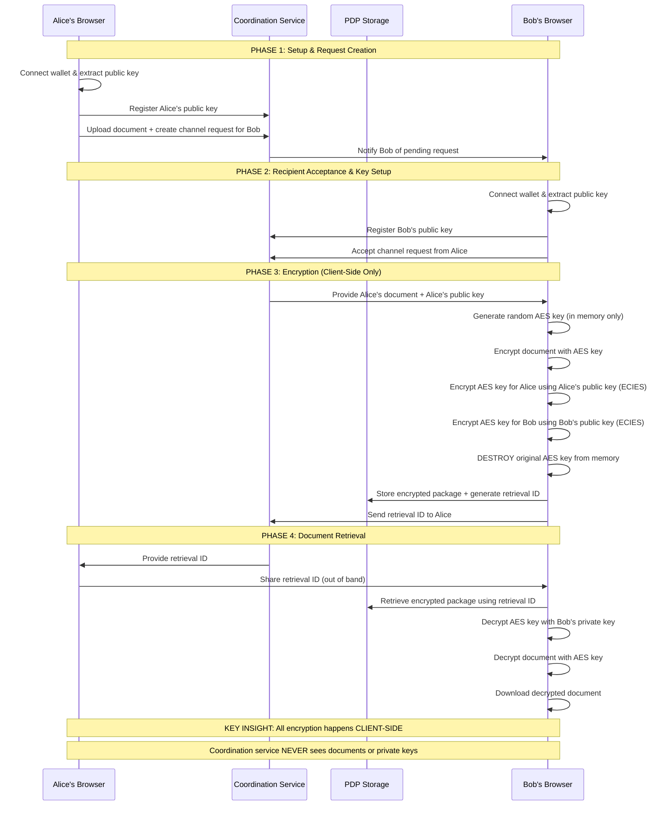

# Engineering Design: Privacy-Preserving Document Encryption

## Overview
Technical implementation details for the FiloSign privacy-preserving document encryption system. This document covers the hybrid encryption architecture, cryptographic protocols, and implementation specifications.

## Architecture Overview

### CRITICAL ARCHITECTURAL QUESTION: Centralized vs Decentralized

**The Current Design Has a Fundamental Problem:**

❌ **Implied Centralized Service**: The encryption process seems to require a service that:
- Has access to both Alice's and Bob's public keys
- Performs encryption on behalf of both parties
- Acts as a "man in the middle" for the encryption process

❌ **Cross-Client Key Sharing Problem**:
- Alice initiates from her client
- Bob is on a different client
- How does the encryption service get Bob's public key?
- Who/what performs the actual encryption?

### Possible Architectural Solutions

#### Option 1: Truly Decentralized (Client-Side Only)
```
Alice's Client:
1. Alice uploads document (stored temporarily unencrypted)
2. Alice creates "channel request" with Bob's address
3. Bob's client polls for requests OR uses notifications

Bob's Client:
1. Bob sees pending request from Alice
2. Bob accepts → Bob's client fetches Alice's document
3. Bob's client performs encryption locally using both public keys
4. Bob's client stores encrypted package in PDP
5. Bob's client sends retrieval ID back to Alice
```

#### Option 2: Minimal Coordination Service (Hybrid)
```
Coordination Service (No Encryption):
- Manages document requests/notifications
- Stores public keys after user registration
- Coordinates the handoff between clients
- NEVER handles encryption or documents

Client-Side Encryption:
- All encryption happens in browsers
- Clients fetch public keys from coordination service
- Documents never leave client unencrypted
```

#### Option 3: Smart Contract Coordination
```
Smart Contract:
- Stores public key registrations
- Manages document channel requests
- Coordinates handoffs between parties
- Fully decentralized coordination

Client-Side Everything Else:
- Document storage in IPFS/PDP
- All encryption in browser
- Private key management in MetaMask
```

### RECOMMENDED ARCHITECTURE: Option 2 (Minimal Coordination Service)

**Why This Approach:**
- ✅ **Client-side encryption only** - No service ever sees documents or private keys
- ✅ **Minimal coordination** - Service only handles notifications and public key registry
- ✅ **Cross-client communication** - Solves the key sharing problem
- ✅ **Scalable** - Can be deployed on multiple providers
- ✅ **Auditable** - Coordination service has minimal, inspectable functionality

**Architecture Components:**
1. **Coordination Service** (Minimal, Stateless):
   - Public key registry (address → public key mapping)
   - Document channel request management
   - Notification system for pending requests
   - NEVER handles documents, private keys, or encryption

2. **Client-Side Encryption** (Browser-Only):
   - All document encryption/decryption in browser
   - Private key management via MetaMask
   - Direct PDP storage interaction
   - Public key extraction from wallet signatures

3. **Decentralized Storage** (PDP/IPFS):
   - Encrypted document packages only
   - Retrieval ID-based access
   - No metadata or relationship information

### Hybrid Encryption System - Detailed Process

**The AES key is NEVER revealed unencrypted to either party during transmission/storage:**

```javascript
// STEP 1: Generate random AES key (exists only in memory temporarily)
const aes_key = generateRandomAESKey(); // 256-bit random key

// STEP 2: Encrypt the document with AES (symmetric encryption - fast for large files)
const encrypted_document = AES.encrypt(document, aes_key);

// STEP 3: Encrypt the SAME AES key separately for BOTH parties using their public keys
// This uses ECIES (Elliptic Curve Integrated Encryption Scheme)
const encrypted_key_for_alice = ECIES.encrypt(aes_key, alice_public_key);
const encrypted_key_for_bob = ECIES.encrypt(aes_key, bob_public_key);

// STEP 4: DESTROY the original AES key from memory (security best practice)
// aes_key = null; // Original key no longer exists anywhere

// STEP 5: Store ONLY encrypted data in PDP (NO addresses for privacy)
store({
  encrypted_document,           // Document encrypted with AES
  encrypted_key_for_alice,     // AES key encrypted with Alice's public key
  encrypted_key_for_bob,       // AES key encrypted with Bob's public key
  retrieval_id
  // NOTE: The original AES key is gone - only encrypted versions exist!
});
```

**Key Security Properties:**
- ✅ **AES key never stored unencrypted** - Only encrypted versions exist
- ✅ **Only Alice can decrypt her encrypted key** - Requires her private key
- ✅ **Only Bob can decrypt his encrypted key** - Requires his private key
- ✅ **Same document content** - Both decrypt to identical AES key
- ✅ **No key sharing required** - Each party decrypts independently

### Privacy-Preserving Access Control & Decryption Process

**How Bob (or Alice) decrypts the document without ever seeing the AES key unencrypted:**

```javascript
// Client-side access control - NO addresses stored on-chain
function attemptDecryption(encryptedPackage, userPrivateKey) {
  try {
    // STEP 1: Try to decrypt the first encrypted AES key using user's private key
    const aes_key = ECIES.decrypt(encryptedPackage.encrypted_key_for_alice, userPrivateKey);

    // STEP 2: If successful, use the recovered AES key to decrypt the document
    const document = AES.decrypt(encryptedPackage.encrypted_document, aes_key);

    // STEP 3: Immediately destroy the AES key from memory
    // aes_key = null;

    return document; // Success - user is Alice
  } catch {
    try {
      // STEP 1: Try to decrypt the second encrypted AES key
      const aes_key = ECIES.decrypt(encryptedPackage.encrypted_key_for_bob, userPrivateKey);

      // STEP 2: If successful, decrypt the document
      const document = AES.decrypt(encryptedPackage.encrypted_document, aes_key);

      // STEP 3: Destroy the AES key from memory
      // aes_key = null;

      return document; // Success - user is Bob
    } catch {
      throw new Error('Access denied'); // User is neither Alice nor Bob
    }
  }
}
```

**Key Security Properties During Decryption:**
- ✅ **AES key exists only temporarily in memory** - Never persisted
- ✅ **Only the correct private key can decrypt** - ECIES ensures this
- ✅ **Same AES key recovered by both parties** - But independently
- ✅ **No key transmission** - Each party decrypts their own copy
- ✅ **Privacy benefit**: No way to determine WHO the authorized parties are
- ✅ **Access control**: Only the parties themselves know they can decrypt it

## Data Structures

### EncryptedPackage (Privacy-Preserving)
```typescript
interface EncryptedPackage {
  encrypted_document: string // Base64 encoded AES-encrypted content
  encrypted_key_for_alice: string // ECIES encrypted AES key (first authorized party)
  encrypted_key_for_bob: string // ECIES encrypted AES key (second authorized party)
  retrieval_id: string
  // NOTE: No sender_address, recipient_address, filename, file_size, or timestamp
  // This prevents metadata leakage and relationship analysis
}
```

### Document Storage Schema
```typescript
interface Document {
  id: string;
  retrievalId: string;
  encryptedDocument: EncryptedDocument; // Privacy-preserving encrypted document
  createdAt: string;
  status: 'pending' | 'signed';
  // NOTE: No sender/recipient addresses, names, titles, or filenames stored
  // This prevents metadata leakage and relationship analysis
}
```

## Cryptographic Protocols

### Public Key Discovery (CRITICAL LIMITATION)
```typescript
class PublicKeyService {
  async discoverPublicKey(walletAddress: string, signer: any): Promise<string>
  async getPublicKey(walletAddress: string): Promise<string | null>
  async cachePublicKey(walletAddress: string, publicKey: string): Promise<void>
  private validatePublicKey(walletAddress: string, publicKey: string): boolean
  private generateStandardMessage(walletAddress: string): string
}
```

**CRITICAL LIMITATION: Recipient Must Setup Key First**
❌ **Current Problem**: Alice cannot encrypt for Bob using only his wallet address
✅ **Reality**: Bob must sign a message to extract his public key before Alice can encrypt for him

**Key Discovery Process:**
1. Generate standard message: "FiloSign Key Discovery\nAddress: {walletAddress}\nTimestamp: {timestamp}"
2. Request MetaMask signature of the message (REQUIRES WALLET OWNER)
3. Extract public key from signature using viem
4. Validate that derived address matches wallet address
5. Cache public key in localStorage for future use

**IMPLICATION**: This creates a chicken-and-egg problem for the sender-initiated flow

## Proposed Solutions to Public Key Problem

### Solution 1: Public Key Registry (Recommended)
Create a decentralized registry where users can pre-register their public keys:

```typescript
interface PublicKeyRegistry {
  registerPublicKey(address: string, publicKey: string, signature: string): Promise<void>
  getPublicKey(address: string): Promise<string | null>
  isRegistered(address: string): Promise<boolean>
}
```

**Flow:**
1. Users register their public key once (like ENS registration)
2. Alice can encrypt for any registered user
3. Bob can decrypt if he's registered
4. Enables true sender-initiated flow

**Pros:** ✅ Enables sender-initiated encryption, ✅ One-time setup per user
**Cons:** ❌ Requires additional infrastructure, ❌ Public key exposure

### Solution 2: Request-Accept Flow (Current Feasible)
Implement a two-step process where recipient must accept before encryption:

```typescript
interface DocumentRequest {
  requestId: string
  senderAddress: string
  recipientAddress: string
  fileName: string
  message?: string
  status: 'pending' | 'accepted' | 'rejected'
}
```

**Flow:**
1. Alice creates document request for Bob
2. Bob receives notification and accepts request
3. Bob's acceptance triggers his key setup
4. Alice can now encrypt and send document
5. Bob can decrypt document

**Pros:** ✅ No additional infrastructure, ✅ Explicit consent, ✅ Works with current tech
**Cons:** ❌ Two-step process, ❌ Not sender-initiated

### Solution 3: Hybrid Approach
Combine registry with fallback to request-accept:

**Flow:**
1. Alice checks if Bob is registered
2. If registered: Direct encryption and send
3. If not registered: Fall back to request-accept flow
4. Gradually migrate users to registry

**Pros:** ✅ Best of both worlds, ✅ Graceful degradation
**Cons:** ❌ Complex implementation, ❌ Two different flows

## Corrected Flow Diagram

The following sequence diagram illustrates the corrected request-accept flow that addresses the public key limitation:



### Encryption Service
```typescript
class EncryptionService {
  async encryptDocument(
    fileData: string,
    alicePublicKey: string,
    bobPublicKey: string
  ): Promise<EncryptedDocument>

  async decryptDocument(
    encryptedDoc: EncryptedDocument,
    userPublicKey: string
  ): Promise<string | null>

  async canUserAccessDocument(
    encryptedDoc: EncryptedDocument,
    userPublicKey: string
  ): Promise<{ canAccess: boolean; role: 'alice' | 'bob' | 'none'; reason?: string }>
}
```

**Encryption Process:**
1. Convert file to base64/binary
2. Generate random 256-bit AES key
3. Encrypt document data with AES-GCM
4. Get public keys for both authorized parties
5. Encrypt AES key with ECIES for both parties
6. Package all encrypted data (no metadata)

**Decryption Process:**
1. Try to decrypt first encrypted key with user's private key
2. If successful, decrypt document with recovered AES key
3. If failed, try second encrypted key
4. If both fail, access denied

## Implementation Phases

### Phase 1: Core Encryption Services
- PublicKeyService for wallet key discovery and caching
- EncryptionService for hybrid encryption/decryption
- Privacy-preserving data structures

### Phase 2: Storage Integration
- PDPStorageService for encrypted document storage
- Retrieval ID generation and document lookup
- No metadata storage (privacy-first)

### Phase 3: UI Components
- DocumentUpload component with encryption workflow
- DocumentDownload component with decryption workflow
- Progress indicators and error handling

### Phase 4: Application Integration
- Main app orchestration
- Wallet integration (MetaMask)
- User onboarding and key setup

## Security Considerations

### Cryptographic Libraries (Production)
- `@noble/secp256k1` for ECDH key exchange
- `@noble/ciphers` for AES encryption
- `@noble/hashes` for key derivation
- Web Crypto API for additional AES operations

### Security Requirements
- Use proper key derivation (HKDF)
- Add authentication (HMAC)
- Include nonce/IV for each encryption
- Verify public key ownership before encryption
- Implement secure key storage and caching

### Privacy Guarantees
- Zero relationship leakage (no addresses stored)
- Cryptographic access control only
- Metadata protection (no filenames, sizes, timestamps)
- Pattern analysis resistance
- Plausible deniability

## Testing Strategy

### Unit Tests
- Encryption/decryption round-trip tests
- Public key discovery and validation
- Access control verification
- Error handling and edge cases

### Integration Tests
- End-to-end document sharing workflow
- Multi-user scenarios
- Storage and retrieval operations
- Wallet integration testing

### Security Tests
- Unauthorized access attempts
- Key validation and verification
- Cryptographic primitive testing
- Privacy leakage analysis

## Performance Considerations

### Optimization Targets
- File encryption/decryption speed
- Public key discovery caching
- Storage efficiency
- Network request minimization

### Scalability
- Large file handling with streaming
- Efficient metadata indexing
- PDP provider selection and failover
- Client-side processing optimization

## Deployment Architecture

### Client-Side Components
- React application with encryption services
- MetaMask wallet integration
- Local storage for key caching
- Progressive web app capabilities

### Storage Layer
- PDP (Programmable Data Platform) integration
- Distributed storage with redundancy
- Retrieval ID-based document lookup
- No centralized metadata storage

### Security Infrastructure
- Client-side encryption only
- No server-side key management
- Decentralized architecture
- Self-sovereign document access
