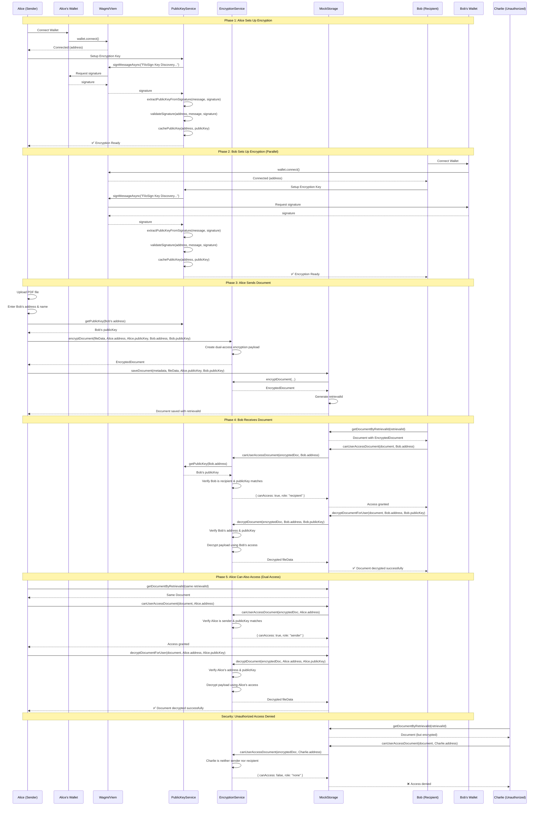
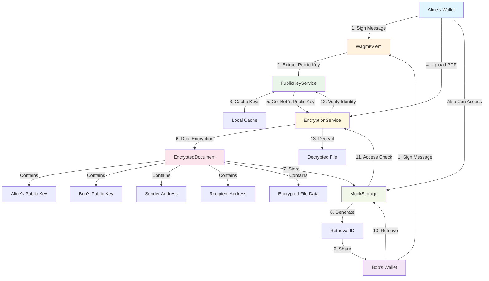

# FiloSign Encryption Architecture

## Overview

The FiloSign encryption system has been redesigned to use **proper public key cryptography** with **dual access** capabilities, allowing both the sender and recipient to decrypt documents using their respective private keys.

## Key Principles

### ✅ **1. Public Key Cryptography**
- **Encryption**: Uses recipient's public key (extracted from wallet signature)
- **Decryption**: Requires corresponding private key (in wallet)
- **Address Matching**: Exact address comparison (no case-insensitive fallback)

### ✅ **2. Dual Access Model**
- **Sender Access**: Can decrypt documents they sent
- **Recipient Access**: Can decrypt documents sent to them
- **No Third Party**: Only these two parties can access the document

### ✅ **3. Public Key Discovery**
- **Wallet Signatures**: Extract public keys from MetaMask signatures
- **Caching**: Store public keys locally for performance
- **Validation**: Verify signature matches wallet address

## Architecture Components

### 1. Public Key Service (`/src/lib/public-key-service.ts`)

**Purpose**: Extract and cache public keys from wallet signatures

**Key Functions:**
```typescript
// Discover public key from wallet signature
async discoverPublicKey(walletAddress: string, signMessageAsync: Function): Promise<string>

// Get cached public key
async getPublicKey(walletAddress: string): Promise<string | null>

// Cache public key for future use
async cachePublicKey(walletAddress: string, publicKey: string): Promise<void>
```

**Process:**
1. Generate standard message for signing
2. Request wallet signature via Wagmi
3. Extract public key from signature using Viem
4. Validate signature matches wallet address
5. Cache validated public key

### 2. Encryption Service (`/src/lib/encryption-service.ts`)

**Purpose**: Handle document encryption/decryption with dual access

**Key Functions:**
```typescript
// Encrypt document for dual access
async encryptDocument(
  fileData: string,
  senderAddress: string,
  senderPublicKey: string,
  recipientAddress: string,
  recipientPublicKey: string
): Promise<EncryptedDocument>

// Decrypt document (sender or recipient)
async decryptDocument(
  encryptedDoc: EncryptedDocument,
  userAddress: string,
  userPublicKey: string
): Promise<string | null>

// Check access permissions
async canUserAccessDocument(
  encryptedDoc: EncryptedDocument,
  userAddress: string
): Promise<{ canAccess: boolean; role: 'sender' | 'recipient' | 'none' }>
```

**Encrypted Document Structure:**
```typescript
interface EncryptedDocument {
  encryptedData: string;           // Base64 encoded encrypted payload
  senderPublicKey: string;         // Sender's public key
  recipientPublicKey: string;      // Recipient's public key
  senderAddress: string;           // Sender's wallet address
  recipientAddress: string;        // Recipient's wallet address
  encryptionMethod: 'dual-key-access';
}
```

### 3. Mock Storage (`/src/lib/mock-storage.ts`)

**Purpose**: Store encrypted documents with proper access control

**Updated Document Interface:**
```typescript
interface Document {
  id: string;
  retrievalId: string;
  title: string;
  fileName: string;
  encryptedDocument: EncryptedDocument;  // ✅ New: proper encryption
  senderAddress: string;
  senderName: string;
  recipientAddress: string;
  recipientName: string;
  createdAt: string;
  signedAt?: string;
  status: 'pending' | 'signed';
}
```

**Key Functions:**
```typescript
// Save document with encryption
async saveDocument(
  doc: DocumentData,
  fileData: string,
  senderPublicKey: string,
  recipientPublicKey: string
): Promise<Document>

// Decrypt document for user
async decryptDocumentForUser(
  document: Document,
  userAddress: string,
  userPublicKey: string
): Promise<string | null>

// Check user access
async canUserAccessDocument(
  document: Document,
  userAddress: string
): Promise<AccessResult>
```

## Workflow

### Send Document Process

1. **User Connects Wallet**
   - Extract public key via signature
   - Cache public key locally

2. **Select Recipient**
   - Enter recipient wallet address
   - Verify recipient has public key available

3. **Upload Document**
   - Convert file to base64
   - Get recipient's public key from cache
   - Encrypt with dual access (sender + recipient keys)

4. **Save Document**
   - Store encrypted document with metadata
   - Generate retrieval ID
   - Return ID to sender

### Receive Document Process

1. **User Connects Wallet**
   - Extract public key via signature
   - Cache public key locally

2. **Enter Retrieval ID**
   - Fetch document from storage
   - Verify user is sender or recipient

3. **Access Verification**
   - Check exact address match
   - Verify public key matches cached key
   - Confirm user role (sender/recipient)

4. **Decrypt Document**
   - Use user's public key for decryption
   - Verify payload integrity
   - Display decrypted document

## Security Features

### ✅ **Address Verification**
```typescript
// Exact address matching (no case-insensitive)
const isSender = encryptedDoc.senderAddress === userAddress;
const isRecipient = encryptedDoc.recipientAddress === userAddress;
```

### ✅ **Public Key Validation**
```typescript
// Verify public key matches expected key
const expectedPublicKey = isSender ? encryptedDoc.senderPublicKey : encryptedDoc.recipientPublicKey;
if (userPublicKey !== expectedPublicKey) {
  return null; // Access denied
}
```

### ✅ **Payload Integrity**
```typescript
// Verify decrypted payload matches metadata
if (decryptedPayload.senderAddress !== encryptedDoc.senderAddress ||
    decryptedPayload.recipientAddress !== encryptedDoc.recipientAddress) {
  return null; // Integrity check failed
}
```

## Error Handling

### Common Scenarios

1. **Recipient Public Key Not Found**
   ```
   "Cannot find public key for recipient address. The recipient must connect their wallet and set up encryption first."
   ```

2. **Access Denied**
   ```
   "Access denied. This document is for sender 0x123... or recipient 0x456..."
   ```

3. **Public Key Mismatch**
   ```
   "Public key mismatch" (logged to console with details)
   ```

4. **Decryption Failed**
   ```
   "Document decryption failed. Please check the browser console for details."
   ```

## MVP vs Production

### Current MVP Implementation
- **Encryption**: Base64 encoding with metadata
- **Access Control**: Address and public key verification
- **Storage**: Local storage with proper structure

### Production Recommendations
- **ECIES Encryption**: Use elliptic curve integrated encryption
- **Symmetric Keys**: AES encryption with dual-encrypted keys
- **Key Derivation**: HKDF for proper key management
- **Authentication**: HMAC for message authentication
- **Libraries**: `@noble/secp256k1`, `@noble/ciphers`, `@noble/hashes`

## Testing

### Debug Commands
```javascript
// Check user's public key
await publicKeyService.getPublicKey('0x...');

// Test document access
await encryptionService.canUserAccessDocument(encryptedDoc, userAddress);

// Manual decryption test
await encryptionService.decryptDocument(encryptedDoc, userAddress, userPublicKey);
```

### Test Scenarios
1. **Sender Access**: Sender can decrypt their own documents
2. **Recipient Access**: Recipient can decrypt received documents
3. **Third Party Denial**: Random addresses cannot access documents
4. **Public Key Mismatch**: Wrong public key prevents access

## Files Modified

1. **`/src/lib/encryption-service.ts`** - New encryption service
2. **`/src/lib/mock-storage.ts`** - Updated to use proper encryption
3. **`/src/app/send/page.tsx`** - Updated send process
4. **`/src/app/receive/page.tsx`** - Updated receive process

The new architecture provides proper public key cryptography with dual access while maintaining exact address matching and comprehensive security validation.

## Sequence Diagrams

### Complete Encryption Flow



### Key and Data Flow



## Key Insights from Diagrams

### 🔐 **No Smart Contracts Needed**
As you correctly noted, **no blockchain contracts are required** for the encryption flow. The system uses:
- **Wallet signatures** for public key extraction
- **Local storage** for document storage (MockStorage)
- **Client-side encryption** for security

### 🔄 **Dual Access Pattern**
The sequence diagram shows how **both Alice and Bob** can decrypt the same document:
- **Alice (sender)**: Can access documents she sent
- **Bob (recipient)**: Can access documents sent to him
- **Charlie (unauthorized)**: Cannot access any documents

### 🔑 **Key Management Flow**
1. **Wagmi/Viem** handles wallet connections and signing
2. **PublicKeyService** extracts and caches public keys
3. **EncryptionService** manages dual-access encryption
4. **MockStorage** provides secure document storage

### 🛡️ **Security Layers**
- **Address Verification**: Exact matching (sender or recipient)
- **Public Key Validation**: Ensures key ownership
- **Payload Integrity**: Verifies decrypted data
- **Role-Based Access**: Different permissions for sender vs recipient

The diagrams clearly show that the system achieves secure document sharing without requiring smart contracts, using only wallet signatures and client-side encryption.
